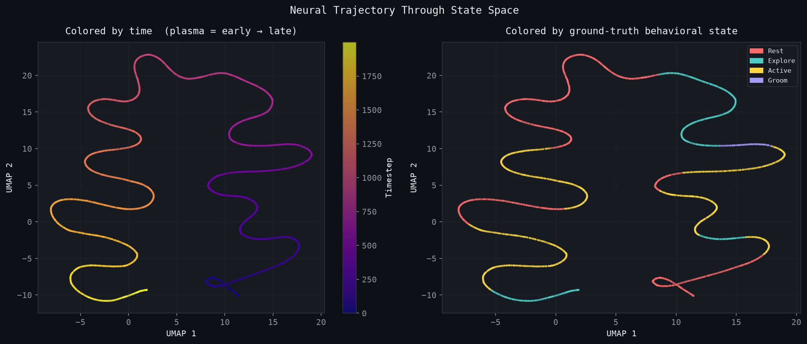
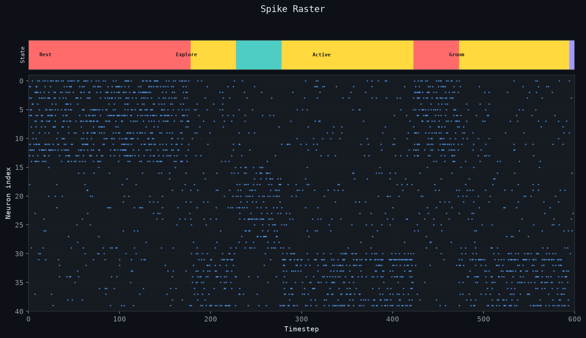
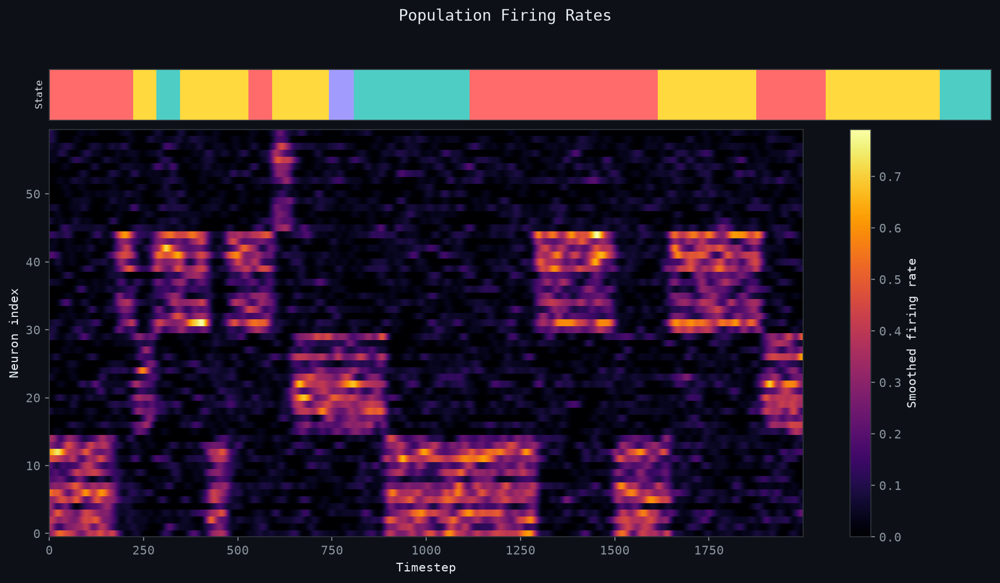
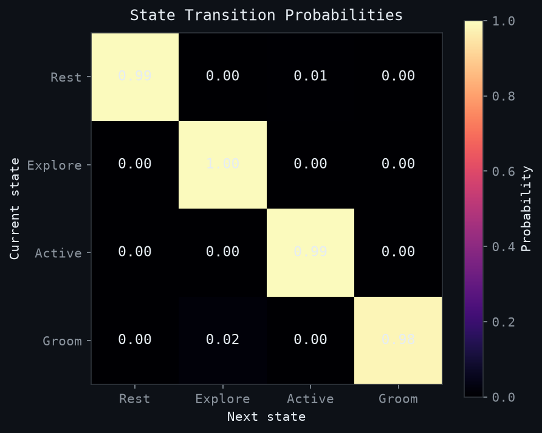
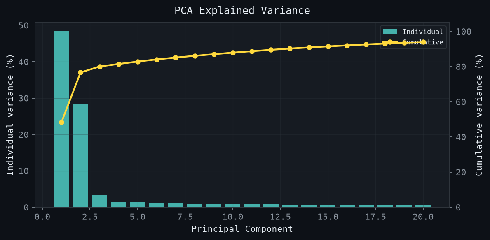

# Neural Representation Explorer

**60 simulated neurons. 4 behavioral states. PCA and UMAP recover the full state structure in 2-D - no labels needed.**

The population activity of 60 neurons lives in a 60-dimensional space, but the *behaviorally relevant* signal collapses onto a 2-D manifold cleanly enough that unsupervised clustering (K-Means, k=4) finds every state. Silhouette ≈ 0.53, and 13 PCs capture 90% of the variance. The neural manifold hypothesis, on a toy.

> [!NOTE]
> The pipeline auto-runs on every push via **GitHub Actions** and commits the refreshed figures back to this repo - so the images below always reflect the latest code.

---

## How It Works

The pipeline simulates 60 neurons firing over 2000 timesteps, where each neuron's activity is shaped by whichever of four behavioral states (Rest, Explore, Active, Groom) is currently active. State-tuned ensembles fire as Poisson processes; the state sequence itself is a Markov chain with exponentially-distributed dwell times - a coarse but defensible caricature of real cortical population statistics.

A Gaussian kernel (σ = 10 timesteps) smooths raw spikes into continuous firing-rate vectors. Two dimensionality reduction methods - PCA (linear, global) and UMAP (nonlinear, neighborhood-preserving) - compress the 60-D activity into 2-D, and K-Means (k = 4) labels each moment in time with its inferred state. The interesting result is *not* that K-Means works, but that the 2-D embedding has enough structure for it to work at all.

---

## Why This Matters

For decades, neuroscientists wondered whether large-scale neural recordings carried genuinely high-dimensional signals or whether the dynamics were constrained to a much lower-dimensional subspace. The latter turned out to be true: in motor cortex, prefrontal cortex, hippocampus, and elsewhere, population activity tends to be confined to a manifold whose dimensionality is closer to the number of behaviors or task variables than to the number of neurons. This repo is a minimal, transparent demonstration of that geometry - and a sandbox for the analysis tools (PCA, UMAP, clustering) that have become standard in the field.

---

## Neuroscience Background

If you come from an ML background, the relevant intuition is this: **neural population data is low-rank for the same reason that natural images are low-rank.** Neurons are heavily correlated by shared inputs, recurrent connectivity, and task-driven covariation, so a recording of *N* neurons rarely has rank *N*.

- **Cunningham & Yu (2014, _Nat Neurosci_), "Dimensionality reduction for large-scale neural recordings"** - the canonical review. Argues that population-level analyses (PCA, factor analysis, GPFA) reveal computational structure invisible at the single-neuron level. The TL;DR: *the population is the computational unit, not the cell.*
- **Shenoy lab (Stanford)** - showed that motor cortex during reaching lives on a ~10-D manifold whose rotational dynamics directly predict muscle output (Churchland et al., 2012, _Nature_). Reach kinematics fall out of the manifold geometry, not from any single neuron's tuning.
- **Neural manifold hypothesis** - the broader claim that behavior is encoded in *trajectories* through a low-D subspace, and that learning, decision-making, and state changes correspond to navigating that subspace. Gallego, Perich, Miller and colleagues have shown these manifolds are stable across days and even partially conserved across animals.

This repo reproduces the simplest version of that picture: distinct behavioral states sit in distinct regions of a low-D embedding, and the trajectory through state space is recoverable without supervision. The leap from here to real Neuropixels data is mostly a matter of scale and noise, not of method.

---

## Visualizations

| Figure | What it shows |
|--------|---------------|
| `manifolds.png` | PCA & UMAP scatter, colored by cluster |
| `trajectory.png` | Population path through state space over time |
| `spike_raster.png` | Raw spikes annotated with behavioral state |
| `firing_rates.png` | Smoothed neural activity heatmap by state |
| `transitions.png` | Empirical Markov transition probability matrix |
| `pca_variance.png` | How much variance each principal component explains |

---

## Results

> Full metrics → [`results/RESULTS.md`](results/RESULTS.md)

### Neural Manifolds - PCA & UMAP

Each behavioral state forms a clean, separated cloud in 2-D.


### Neural Trajectory Through State Space

Left panel shows the population path colored by time; right panel colors each point by its ground-truth behavioral state.



### Spike Raster

Raw spikes for 40 neurons over 600 timesteps, with the active state marked at the top.



### Population Firing Rates

Gaussian-smoothed activity across all 60 neurons, where bright bands mark ensemble activation per state.



### State Transition Matrix

How often each state follows each other state, estimated directly from the simulated sequence.



### PCA Explained Variance

The first few components capture most of the variance, confirming the data lives on a genuinely low-dimensional manifold.



---

## Quick Start

```bash
pip install -r requirements.txt
python run_pipeline.py
# → results/ contains all figures and summary.json
```

---

## Extending to Real Data

The pipeline accepts real extracellular recordings via the `--mode real` flag, which streams a public NWB file from the [DANDI Archive](https://dandiarchive.org/) and bins spike times into the same `(n_neurons, n_timesteps)` array that the simulator produces. Nothing downstream changes.

```bash
pip install dandi remfile h5py pynwb
python run_pipeline.py --mode real
```

### Where to get data

- **DANDI Archive** - the standard public host for NWB-formatted neurophysiology. Filter for dandisets with sorted units tables. Good starting points:
  - [`000003`](https://dandiarchive.org/dandiset/000003) - default in `loaders/nwb_loader.py`
  - [`000409`](https://dandiarchive.org/dandiset/000409) - IBL Brain-Wide Map (Neuropixels, many regions)
  - [`000053`](https://dandiarchive.org/dandiset/000053) - Steinmetz et al. visual cortex Neuropixels
- **Allen Brain Observatory** - Neuropixels Visual Coding / Visual Behavior datasets, downloadable as NWB.
- **IBL Public Data Portal** - task-aligned recordings across the mouse brain.

To point the loader at a different dandiset, edit `DANDISET_ID` in `loaders/nwb_loader.py`, or call `load_nwb_spikes("000409")` directly. The loader caps the streamed window at 20 s of recording (≈ 2000 bins at 10 ms) so you can iterate without pulling gigabytes.

### Expected input format

The loader produces what the rest of the pipeline expects:

| Field | Type | Meaning |
|-------|------|---------|
| `spikes` | `ndarray (n_neurons, n_timesteps)` float32 | binned spike counts, 10 ms bins by default |
| `state_labels` | `ndarray (n_timesteps,)` int | ground-truth states (all-zeros for real data - no labels) |

If you have a recording in another format (Phy/Kilosort `.npy`, Plexon, Blackrock, raw `.dat`), the easiest path is to convert it to NWB with [NeuroConv](https://neuroconv.readthedocs.io/) and reuse the existing loader. For one-off use, write a thin wrapper that returns the same two-array tuple.

### Interpreting the outputs on real data

A few things change once `state_labels` becomes uninformative:

- **`manifolds.png`** - clusters now reflect *discovered* population states, not ground truth. Inspect cluster centroids in the original neuron-space to see which subpopulations dominate each state; cross-reference with behavioral video / task events if available.
- **`trajectory.png`** - the left panel (color = time) becomes the more useful one. Smooth, recurring loops imply oscillatory dynamics; one-way drift suggests learning, adaptation, or electrode drift.
- **`pca_variance.png`** - the number of PCs needed to reach 90% variance is the headline number. Real cortex typically sits in the 10–30 range; an unrealistically low value (≤ 3) usually means the recording is dominated by a few highly active units or by motion artifact.
- **`transitions.png`** - meaningful only if you re-label the K-Means clusters by what behavior they co-occur with. Otherwise it shows transitions between *latent* states.
- **Silhouette score** - drops sharply (often to 0.1–0.3) on real data; this is expected. Real population states overlap because behavior overlaps.

---

## Project Structure

```
neural_representation_explorer/
├── run_pipeline.py              # full pipeline
├── requirements.txt
├── CITATION.md
├── neural_population_states.png
├── .github/
│   └── workflows/
│       └── run_pipeline.yml
├── src/
│   ├── __init__.py
│   ├── simulate_spikes.py
│   ├── compute_features.py
│   ├── dimensionality.py
│   └── clustering.py
├── loaders/
│   ├── __init__.py
│   └── nwb_loader.py            # DANDI/NWB streaming for --mode real
├── notebooks/
│   └── explore_representations.ipynb
└── results/                     # auto-generated
    ├── RESULTS.md
    ├── summary.json
    ├── manifolds.png
    ├── trajectory.png
    ├── spike_raster.png
    ├── firing_rates.png
    ├── transitions.png
    ├── pca_variance.png
    └── cluster_distribution.png
```

---

## If You Use This

If this repo helped your research, teaching, or a blog post, a citation is appreciated. See [`CITATION.md`](CITATION.md) for BibTeX. Short form:

> Graham, P. (2026). *Neural Representation Explorer*. GitHub. https://github.com/peterajhgraham/neural-representation-explorer

If you build on the methodology rather than the code, please also cite the foundational works it leans on - Cunningham & Yu (2014), Churchland et al. (2012), and the UMAP paper (McInnes et al., 2018).
