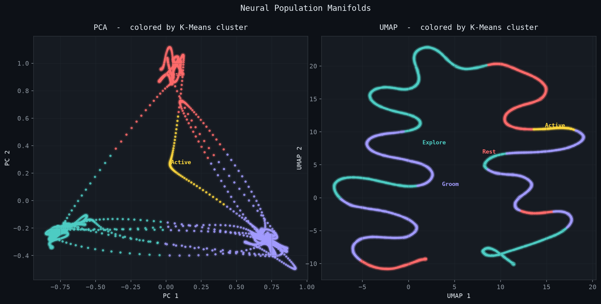

# neural-representation-explorer

A tiny, self-contained demo of the **neural manifold hypothesis**. Simulate 60 neurons across 4 behavioral states, smooth the spikes into firing rates, and watch PCA/UMAP + K-means recover the full state structure in 2D — no labels.



The population lives in 60D, but the behaviorally relevant signal collapses onto a 2D manifold cleanly enough that unsupervised clustering finds every state (silhouette ≈ 0.53, 13 PCs for 90% of the variance). That's the whole point — real cortex does the same thing, at scale.

### install

```bash
pip install -r requirements.txt
```

### run

```bash
python run_pipeline.py
```

Figures and `summary.json` land in `results/` (see [`results/RESULTS.md`](results/RESULTS.md)). The pipeline re-runs on every push via GitHub Actions and commits fresh figures, so the images here always match the code.

### how it works

State-tuned neuron ensembles fire as Poisson processes; the state sequence is a Markov chain with exponential dwell times. A Gaussian kernel (σ=10 bins) turns spikes into firing rates. PCA (linear, global) and UMAP (nonlinear, local) drop the 60D activity to 2D, and K-means (k=4) labels each timestep. The interesting bit isn't that K-means works — it's that the 2D embedding has enough structure for it to work at all.

One small module per step: `src/{simulate_spikes, compute_features, dimensionality, clustering}.py`.

### real data

`--mode real` streams a public NWB file from [DANDI](https://dandiarchive.org/) and bins spike times into the same `(n_neurons, n_timesteps)` array the simulator produces — nothing downstream changes.

```bash
pip install dandi remfile h5py pynwb
python run_pipeline.py --mode real
```

Edit `DANDISET_ID` in `loaders/nwb_loader.py` to point elsewhere (e.g. `000409`, the IBL Brain-Wide Map). On real data the silhouette drops to ~0.1–0.3 and clusters become discovered states rather than ground truth — both expected.

### refs

- Cunningham & Yu (2014), *Dimensionality reduction for large-scale neural recordings*, Nat Neurosci
- Churchland et al. (2012), *Neural population dynamics during reaching*, Nature
- Gallego et al. (2017), *Neural manifolds for the control of movement*, Neuron
- McInnes et al. (2018), *UMAP*, arXiv:1802.03426
